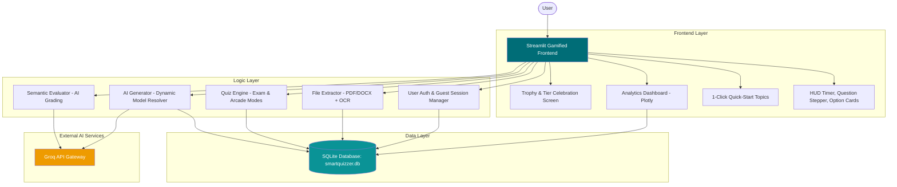

# 🧠 SmartQuizzer Pro


**SmartQuizzer Pro** is a modern, AI-powered gamified learning platform that turns static study materials (PDFs, DOCX, scanned notes, or pasted text) into interactive, Kahoot/Quizizz-style quizzes with real-time semantic evaluation, instant practice modes, and deep performance analytics.

---

## 📑 Table of Contents

- [🌟 Key Highlights & New Features](#-key-highlights--new-features)
- [🏗️ System Architecture](#️-system-architecture)
- [🛠 Tech Stack](#-tech-stack)
- [🚀 Quick Start (Local Setup)](#-quick-start-local-setup)
- [☁️ Cloud Deployment Guide](#️-cloud-deployment-guide)
  - [1. Streamlit Community Cloud](#1-streamlit-community-cloud)
  - [2. Render Deployment](#2-render-deployment)
  - [3. Docker Container](#3-docker-container)
- [📖 Core Workflow](#-core-workflow)
- [📂 Project Structure](#-project-structure)
- [🗄 Backend & Data Storage](#-backend--data-storage)
- [👥 Contributors](#-contributors)

---

## 🌟 Key Highlights & New Features

### 🎮 Modern Gamified Quiz Experience
* **Interactive Option Cards**: Spacious, elevated clickable cards (Kahoot & Quizizz style) with distinct letter badges (`A`, `B`, `C`, `D`), smooth hover elevations, and selected states.
* **Live HUD & Session Timer**: Real-time elapsed time ticker (`⏱️ 01:45`), difficulty indicators (`🟢 Easy`, `🟡 Medium`, `🔴 Hard`), and question counter badges.
* **Interactive Question Stepper**: Numbered pill stepper (`[1 ✓] [2 ✓] [3] [4] [5]`) showing answered questions and allowing learners to jump directly to any question.
* **Dual Quiz Modes**:
  * **📝 Exam Mode**: Simulate formal testing with review capabilities before final submission.
  * **⚡ Arcade Practice Mode**: Instant validation on every choice with immediate sound cues and XP feedback.
* **Dedicated Submission Flow**: Solves premature submission bugs with explicit grading confirmation.
* **Celebratory Results Screen**:
  * Performance tiers (`🏆 Quiz Master`, `🥇 Quiz Champion`, `🥈 Rising Star`, `💡 Knowledge Seeker`).
  * 4-Card HUD (Total Score, Accuracy %, Time Elapsed, and Pass/Review status).
  * Comprehensive question-by-question breakdown with color-coded comparison and explanations.
  * Instant options to **Retake Quiz**, **Generate New Quiz**, or **Export CSV Results**.

### ⚡ 1-Click Quick-Start Demo Topics
* Generate a full quiz in seconds without uploading files:
  * 🐍 **Python Core**: Data structures, functions, OOP, and exceptions.
  * 🤖 **AI & Machine Learning**: Supervised/unsupervised learning, neural nets, clustering.
  * 🌍 **World Capitals**: Global geography, iconic capitals, and landmarks.
  * 🔬 **Cell Biology**: Organelles, DNA, cellular respiration, and photosynthesis.

### 🔐 Flexible Access & Guest Mode
* **Instant Guest Play**: Jump straight into learning with one click without mandatory registration.
* **User Accounts**: Secure SQLite-backed credentials with persistent attempt history.

### 🧠 Intelligent Multi-Model AI Engine
* Powered by the **Groq Cloud API** with automatic model discovery and fallback (supporting `llama-3.1-8b-instant`, `qwen/qwen3.8-27b`, `openai/gpt-oss-20b`, `groq/compound-mini`).
* Semantic subjective grading for short answer questions.

---

## 🏗️ System Architecture



---

## 🛠 Tech Stack

- **Frontend / Framework**: Streamlit 1.56+
- **AI Core**: Groq Cloud SDK (Llama 3.1 / Qwen / GPT-OSS)
- **OCR Engine**: Tesseract OCR & `pdf2image`
- **Database**: SQLite (Zero-configuration persistent storage)
- **Visualizations**: Plotly Express & Graph Objects
- **Styling**: Modern Glassmorphism CSS & Plus Jakarta Sans typography
- **Deployment**: Streamlit Community Cloud, Render (`render.yaml`), Docker (`Dockerfile`)

---

## 🚀 Quick Start (Local Setup)

### 1. Prerequisites
- Python 3.8 to 3.13
- Optional for scanned PDFs: [Tesseract OCR](https://github.com/tesseract-ocr/tesseract)

### 2. Clone Repository
```bash
git clone https://github.com/sujal971/TeamB_final_Project.git
cd TeamB_final_Project
```

### 3. Create Virtual Environment & Install Dependencies
```bash
# Windows
python -m venv .venv
.venv\Scripts\activate

# Linux / macOS
python3 -m venv .venv
source .venv/bin/activate

pip install -r requirements.txt
```

### 4. Configure Environment Variables
Create a `.env` file in the project root:
```env
GROQ_API_KEY=your_groq_api_key_here
# Optional model override (defaults to auto-detect):
GROQ_MODEL=qwen/qwen3.8-27b
```

### 5. Launch Application
```bash
streamlit run app.py
```
Open [http://localhost:8501](http://localhost:8501) in your browser.

---

## ☁️ Cloud Deployment Guide

### 1. Streamlit Community Cloud (Recommended & Free)
1. Fork or push this repository to GitHub.
2. Visit [share.streamlit.io](https://share.streamlit.io) and log in with GitHub.
3. Click **"New App"** and select:
   - **Repository:** `sujal971/TeamB_final_Project`
   - **Branch:** `master` (or `main`)
   - **Main file path:** `app.py`
4. In **Advanced Settings -> Secrets**, add:
   ```toml
   GROQ_API_KEY = "your_groq_api_key"
   ```
5. Click **"Deploy"**!

### 2. Render Deployment
This project includes a native `render.yaml` configuration:
1. Log in to [render.com](https://render.com).
2. Click **New +** -> **Blueprint**.
3. Connect your repository. Render automatically reads `render.yaml` and provisions the web service.
4. Set your `GROQ_API_KEY` under Environment Variables.

### 3. Docker Container
Build and run anywhere with Docker:
```bash
# Build image
docker build -t smartquizzer-pro .

# Run container
docker run -d -p 8501:8501 -e GROQ_API_KEY="your_api_key" smartquizzer-pro
```

---

## 📖 Core Workflow

1. **Input or Quick-Start**: Paste text, upload PDF/DOCX, or pick a 1-click preset.
2. **AI Processing**: Content is chunked to respect TPM limits and passed to Groq API.
3. **Quiz Customization**: Select question count, difficulty, and question type.
4. **Interactive Quiz**: Play in **Exam Mode** or **Arcade Practice Mode** with HUD and Stepper.
5. **Evaluation**: Immediate AI semantic grading and automated score breakdown.
6. **Analytics**: Attempts are saved to SQLite and rendered on the interactive dashboard.

---

## 📂 Project Structure

```text
TeamB_final_Project/
│
├── .streamlit/
│   └── config.toml           # Production theme & headless server config
│
├── data/
│   └── smartquizzer.db       # Persistent SQLite database
│
├── utils/
│   └── storage.py            # SQLite database schema, attempts & quiz caching
│
├── app.py                    # Main Streamlit app & gamified quizzer UI
├── analytics.py              # Performance dashboard & Plotly visualizer
├── question_generator.py     # Prompt engineering & question generator logic
├── quiz_engine.py            # Scoring & attempt evaluations
│
├── Dockerfile                # Production container specification with OCR
├── render.yaml               # Render Infrastructure-as-Code blueprint
├── Procfile                  # Generic cloud process runner
├── requirements.txt          # Python dependencies
├── .env                      # Local environment secrets
└── README.md                 # Complete project documentation
```

---

## 🗄 Backend & Data Storage

The application leverages a self-initializing **SQLite** database (`data/smartquizzer.db`) requiring zero configuration:
* **`users`**: User credentials, salt-hashed passwords, and metadata.
* **`quizzes`**: Historical question sets and difficulty metadata.
* **`attempts`**: Granular attempt logs, timestamps, accuracy percentages, and difficulty breakdowns.

---

## 👥 Contributors

- **Sujal Gupta** – Lead System Architect & Data Analytics
- **Shuchi Makhija** – AI Engineer (LLM Integration & OCR)
- **Shiva** – Backend Developer (Database & Scalability)
- **Lithika D** – UI Developer (UX Design & Animations)

---

<div align="center">
  <sub>Built with ❤️ by Team B for modern interactive learning.</sub>
</div>
